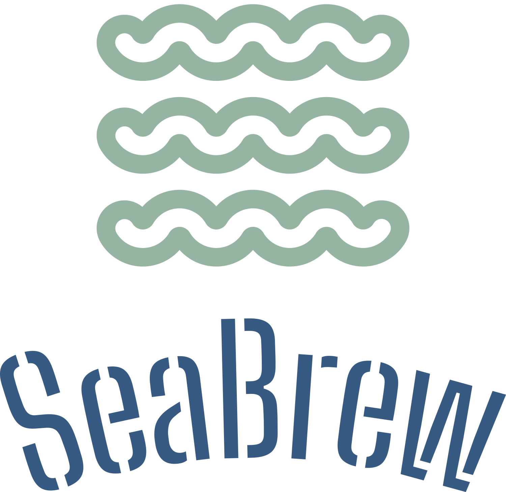

# About Us
- Willsen Yogi Prasetia ( 535220010 )
- Tanjaya Jason Winata ( 535220041 )
- Richard Souwiko ( 535220042 )
- Gavriel Joseph Lim ( 535220049 )
- Jason Sutanto ( 535220052 )

# SeaBrew - Booking Tiket Show dan SB Coffee



SeaBrew adalah aplikasi mobile yang memungkinkan pengguna untuk membooking tiket untuk menonton show di tempat hiburan aquarium dan membeli minuman kopi SB Coffee. Dilengkapi dengan bundle dan poin yang bisa ditukarkan dengan merchandise, SeaBrew mempermudah pengalaman hiburan Anda.

## 🌊 Tentang SeaBrew

SeaBrew merupakan aplikasi yang bertujuan untuk memudahkan pengguna dalam membooking tiket show aquarium, membeli kopi, dan menukarkan poin dengan merchandise. Dengan menggunakan QR code, proses penukaran di lokasi menjadi lebih cepat dan mudah.

## 🌟 Fitur Utama

- **Booking Tiket Show**: Pesan tiket untuk pertunjukan di aquarium.
- **Pembelian Kopi**: Nikmati minuman SB Coffee.
- **Bundle dan Poin**: Beli bundle dan kumpulkan poin untuk merchandise.
- **QR Code**: Scan untuk akses mudah dan cepat di lokasi.

## 🛠️ Teknologi yang Digunakan

- **React Native**: Untuk pengembangan aplikasi mobile.
- **Expo**: Alat bantu untuk pengembangan React Native.
- **Redux**: Manajemen state aplikasi.
- **Firebase**: Backend sebagai layanan untuk otentikasi dan database.

## 💻 Instalasi dan Penggunaan

1. **Clone repositori ini:**
    ```bash
    git clone https://github.com/RichardxSW/SeaBrew.git
    ```
2. **Install dependensi:**
    ```bash
    cd SeaBrew
    npm install
    ```
3. **Jalankan aplikasi:**
    ```bash
    npm start / npx expo start
    ```
4. **Buka aplikasi di Expo Go atau emulator:**
    - Untuk Android, gunakan emulator Android atau perangkat fisik.
    - Untuk iOS, gunakan emulator Xcode atau perangkat fisik.

# Link Proyek
- [https://github.com/RichardxSW/SeaBrew](https://github.com/RichardxSW/SeaBrew.git)
